##  {background-image="river.png" background-size="100%"}

::: {style="height: 50px;"}
:::

::: quote-gold
> "...*doing what little one can to increase the general stock of knowledge is as respectable an object of life, as one can in any likelihood pursue.*"
>
> Charles Darwin
:::

## Monitoring species distributions {background-image="city_plan.gif" background-size="100%"}

> Imagine planning a city without knowing where people live. This is exactly what we risk doing in conservation if we don't accurately map where species exist---and why.

## Monitoring species distributions {.smaller}

::: {style="height: 50px;"}
:::

::::: columns
::: {.column width="40%"}
-   Biodiversity monitoring programs have become essential to **understand** species distributions.

-   The modelling of species distributions is important for both theoretical and applied ecology.

-   The analysis of species distribution data is **challenging**
:::

::: {.column width="60%"}
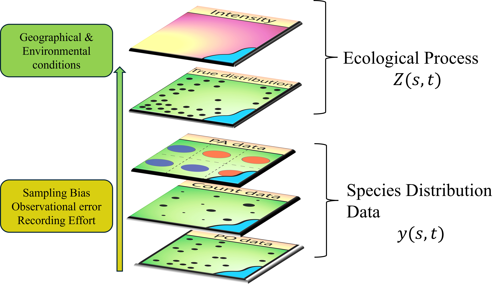{fig-align="center" width="100%" height="100%"}
:::
:::::

::: aside
Figure modified from [@mostert2023]
:::

## The Challenge of Data {.smaller auto-animate="true"}

-   The information available for species distributions models is radically changing

-   New opportunities for surveying wildlife in space and time.

{fig-align="center"}

## The Challenge of Data {.smaller auto-animate="true"}

-   The information available for species distributions models is radically changing

-   New opportunities for surveying wildlife in space and time.

-   As the **volume** of recorded ecological data continues to grow, so does the need for **computationally efficient methods** for fitting complex models.

{fig-align="center"}

## INLA in Ecology {.smaller auto-animate="true"}

The R-INLA package has become a powerful tool for fitting complex models in ecology.

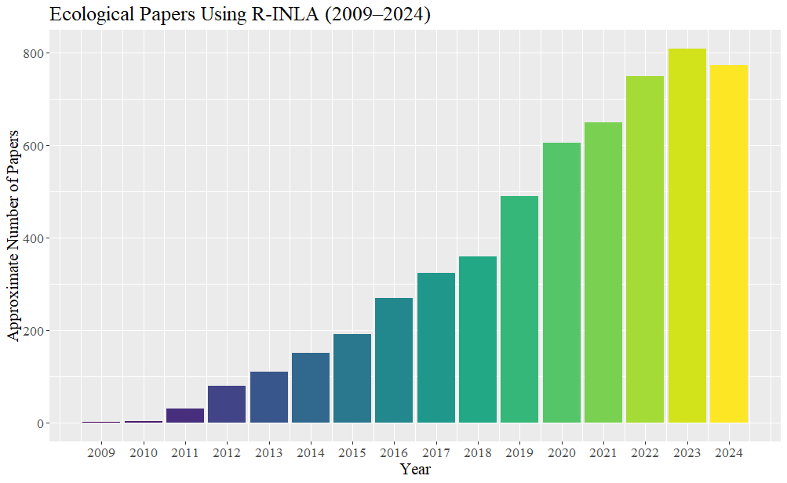{fig-align="center"}

## What is INLA and `inlabru`? {.smaller auto-animate="true"}

-   **Short Answer**

> The Integrated Nested Laplace Approximation (INLA) is a fast method to do Bayesian inference with latent Gaussian models and `inlabru` is an R-package that implements this method with a flexible and simple interface.

## What is INLA and `inlabru`? {.smaller auto-animate="true"}

-   **Short Answer**

> The Integrated Nested Laplace Approximation (INLA) is a fast method to do Bayesian inference with latent Gaussian models and `inlabru` is an R-package that implements this method with a flexible and simple interface.

-   **The (much) longer answer**
    -   Rue, H., Martino, S. and Chopin, N. (2009), Approximate Bayesian inference for latent Gaussian models by using integrated nested Laplace approximations. *Journal of the Royal Statistical Society: Series B (Statistical Methodology)*, 71: 319-392.
    -   Van Niekerk, J., Krainski, E., Rustand, D., & Rue, H. (2023). A new avenue for Bayesian inference with INLA. *Computational Statistics & Data Analysis*, 181, 107692.
    -   Lindgren, F., Bachl, F., Illian, J., Suen, M. H., Rue, H., & Seaton, A. E. (2024). inlabru: software for fitting latent Gaussian models with non-linear predictors. *arXiv preprint* arXiv:2407.00791.
    -   Lindgren, F., Bolin, D., & Rue, H. (2022). The SPDE approach for Gaussian and non-Gaussian fields: 10 years and still running. *Spatial Statistics*, 50, 100599.

## Why INLA? {.smaller auto-animate="true"}

-   Ecological systems are inherently complex

-   The way we observe these processes also matter!

::: fragment
sometimes we do not observe what is actually there ...
:::

{fig-align="center" width="551"}

::: aside
Figure from [@guillera-arroita2016]
:::

## The problem with detection {auto-animate="true"}

{fig-align="center"}

## The problem with detection {auto-animate="true"}

{fig-align="center"}

## Possible biases due to imperfect detection

::: {style="height: 50px;"}
:::

::: incremental
-   Underestimation of species distribution

-   Bias of the estimated relationship with covariates

-   Predictive models might reflect detection instead of occurrence
:::

## The Occupancy model for survey data {.smaller}

::::::: columns
:::: {.column width="50%"}
**Basic idea:** Data contain information about two processes:

-   The species occupancy (ecological process)

-   The detection (observation process)

**Basic model form**

-   Ecological process

    $$
    z_i\sim\text{Bernoulli}(\psi_i)
    $$

-   Observation process

    $$
    y_{ij}\mid z_i=z_i\sim\text{Bernoulli}(p_{ij})
    $$

::: aside
**Note:** The model requires multiple visits per site to be identifiable
:::
::::

:::: {.column width="50%"}
::: {style="height: 50px;"}
:::

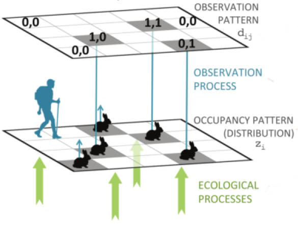{fig-align="center"}
::::
:::::::

## The Occupancy Model for Species Distributions {auto-animate="true"}

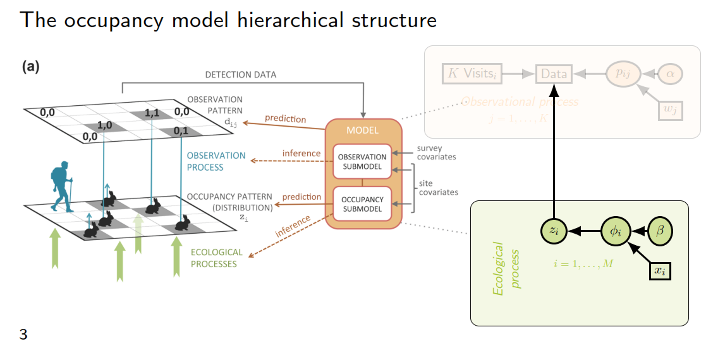{fig-align="center"}

## The Occupancy Model for Species Distributions {auto-animate="true"}

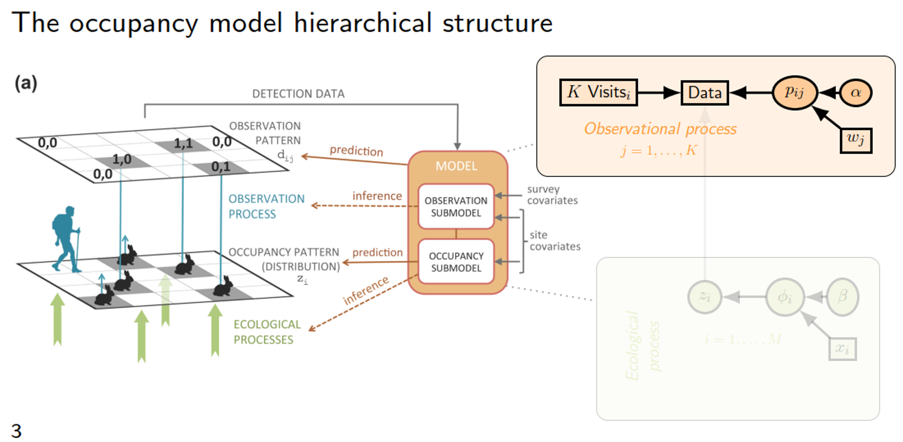{fig-align="center"}

## Occupancy Models in INLA {.smaller}

For a set of set of $M$ discrete sites, let the detection history of the $i$th site $\mathbf{d}_i= y_{i1},\ldots,y_{iK}$.

The joint likelihood is then:

$$
\begin{aligned}
 L(\pmb{\psi},\textbf{p}|\mathbf{y}_1,\ldots,\mathbf{y}_M) &= \underbrace{\prod_{i=1}^{m} \left[\psi_i \prod_j^{K_i} p_{ij}^{y_{ij}} (1-p_{ij})^{1-y_{ij}}\right]}_{\text{sites with at least one detection}}\underbrace{\prod_{i=m+1}^M\left[\psi_i\prod_j^{K_i}(1-p_{ij})+(1-\psi_i)\right]}_{\text{sites with only 0's}}. \\
 &= \prod_{i=1}^{M} \left[\psi_i \prod_j^{K_i} p_{ij}^{y_{ij}} (1-p_{ij})^{1-y_{ij}} + \mathbb{I}_{\sum_j y_{ij} = 0}(1-\psi_i) \right],
\end{aligned}
$$

The likelihood for occupancy model is factorized into univariate models for the marginal distribution of each site detection history.

$$
L(\pmb{\psi},\textbf{p}\mid \mathbf{y}_1,\ldots,\mathbf{y}_M) = \prod_{i=1}^{M} \left[\psi_i \prod_j^{K_i} p_{ij}^{y_{ij}} (1-p_{ij})^{1-y_{ij}} + \mathbb{I}_{\sum_j y_{ij} = 0}(1-\psi_i) \right]
$$

## Estimating Occupancy Models in INLA {.smaller}

@belmont2024 show how this a LGM (and thus possible to be fitted using INLA ) under these conditions:

-   Detection histories are conditional independent given the occurrence and detection probabilities.

-   Considering detection probabilities $p$ as hyperparameters and link the linear predictor $\eta_i$ to the probability of occurrence $\psi_i$ via a known link function $g(\cdot)$.

-   Assume a Gaussian prior for $\eta_i$.

The linear predictor $\eta_i$ can include covariates, smooth terms, random effects, etc. e.g., $$g(\psi_i)=\beta_0 +X'\beta + \omega(s)$$

While the detection model is compromised by a less complex structure where only a limited number of site or survey level covariates can be included, e.g., $$\text{logit}(p_{ij})= \gamma_0 + \gamma_1 \times w_{ij} + \ldots$$

## Planned Survey Data {.smaller auto-animate="true"}

**Structured data** from planned surveys has been a primary source of information for modelling species distributions

-   **Structured data** involves constant monitoring schemes using standardised methods at sites on a regular basis.

![Figure modified from [@guillera-arroita2016]](images/survey_data.png){fig-align="center"}

## Planned **Structured** Survey Data {.smaller auto-animate="true"}

Traditionally, researchers would need to choose between analysing small quantities of **structured data** and large quantities of **unstructured data.**

-   **Structured data** involves constant monitoring schemes using standardised methods at sites on a regular basis.

-   These are **expensive** to collect and tend to be geographically and temporally restricted.

{fig-align="center"}

## Occupancy models and citizen science {.smaller}

**Citizen science** projects offer a cost-effective solution to investigate species distributions at large spatial and temporal scales.

-   Citizen science $\neq$ complete lack of structure

    -   semi-structured surveys

    -   opportunistic encounters

{fig-align="center" width="626"}

## Analysing de distribution of Ringlet butterfly in the UK {.smaller}

We analysed the distribution of the Ringlet butterfly (*Aphantopus hyperantus*) using $>$ 2 million records from 140,887 unique 1 km$^2$ from the BNM programme between 1970 and 2014.

-   Occupancy model framework where

$$
\begin{aligned}
y_{ijt} = \begin{cases} 1 & \text{if Ringlet is on checklist } i \text{ on visit } j \text{ during year } t\\ 0 & \text{any species other than Ringlet is recorded}\end{cases}
\end{aligned}
$$

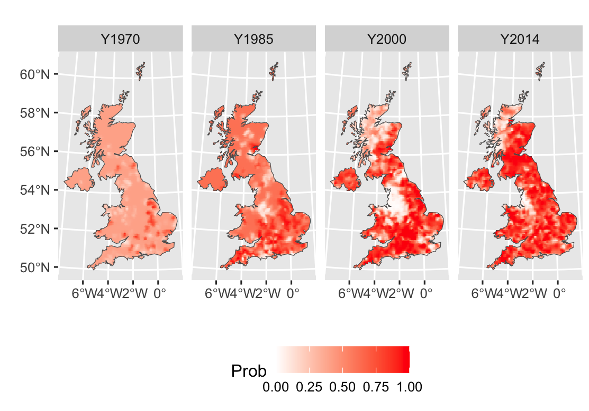{fig-align="center"}

## Analysing de distribution of Ringlet butterfly in the UK {.smaller}

We analysed the distribution of the Ringlet butterfly (*Aphantopus hyperantus*) using $>$ 2 million records from 140,887 unique 1 km$^2$ from the BNM programme between 1970 and 2014.

-   Occupancy model framework where

-   Relative list length and date of visit allow us to account for varying sampling effort and seasonality in detection probabilities.

::: {layout-ncol="2"}
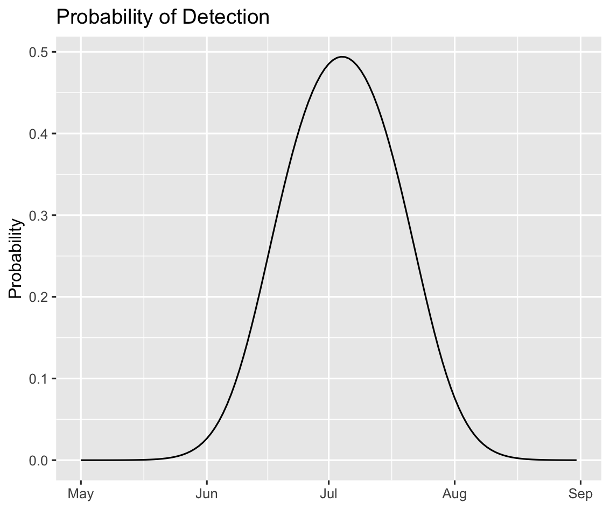{width="325"}

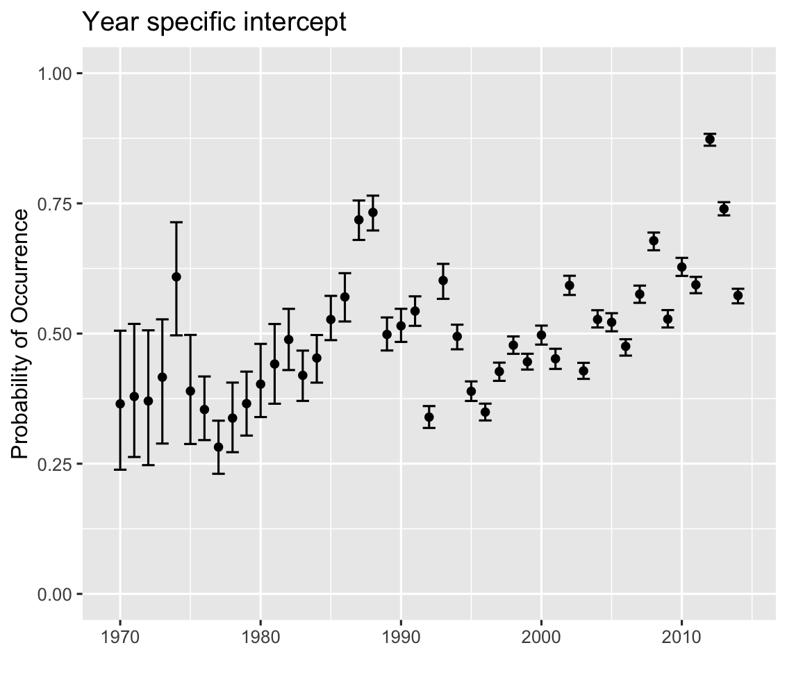{width="325"}
:::

## Analysing de distribution of Ringlet butterfly in the UK {.smaller}

We analysed the distribution of the Ringlet butterfly (*Aphantopus hyperantus*) using $>$ 2 million records from 140,887 unique 1 km$^2$ from the BNM programme between 1970 and 2014.

-   Occupancy model framework where

-   Relative list length and date of visit allow us to account for varying sampling effort and seasonality in detection probabilities.

-   Analysing this entire data set without any spatial effects only took 30 seconds compared to a 19h MCMC algorithm.

::: fragment
-   including a spatial effect increased the running time to 5 minutes only on a standard Apple M2 Pro machine!
:::

<!-- ## Opportunistic Data {.smaller auto-animate="true"} -->

<!-- Most of the times we we only have information of where species is available. -->

<!-- Opportunistic encounters produce **unstructured data** which constitute the majority of available information. -->

<!-- -   Harnessing the power of opportunistic data is not an easy task! -->

<!-- | Advantages 😄👍 | Disadvantages 😔👎 | -->
<!-- |------------------------------------|------------------------------------| -->
<!-- | Extensive taxonomic, spatial and temporal coverage | Under-reporting of rare and inconspicuous species. | -->
<!-- | Eye-catching species that are easily identifiable by participants. | Varying recording skills and uneven sampling effort. | -->

## Opportunistic CS Data{.smaller}

Large volumes of CS data come from **Opportunistic surveys** where sampling effort is **biased** across space and time.

-   Most of the times we we only have information of where species is spotted
-   People visit more certain places than others.

{fig-align="center"}

::: incremental
-   Small populations at lower elevation could be over-sampled.

-   If we assume sampling is evenly distributed, species occupancy at higher elevation would be under-estimated
:::

##  {background-image="CS.gif" background-size="100%"}

::: {style="height: 50px;"}
:::

## Thinned point process model {.smaller auto-animate="true"}

-   The true locations $\mathbf{s}=s_1,\ldots,s_m$ where a species occur are a realization of a Point Process, specifically a log-Gaussian Cox process (LGCP).

$$
\lambda(s)=\exp{X(s)'\beta + Z(s)}
$$

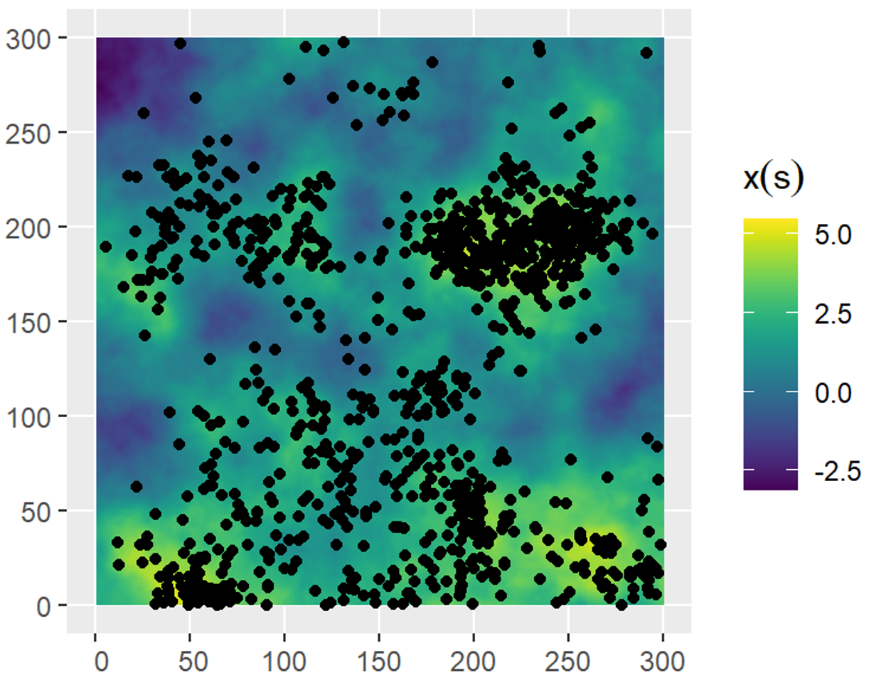{fig-align="center"}

## Thinned point process model {.smaller auto-animate="true"}

-   The true locations $\mathbf{s}=s_1,\ldots,s_m$ where a species occur are a realization of a Point Process, specifically a log-Gaussian Cox process (LGCP).

-   The true point pattern is partially observed due to **imperfect detection** and **accessibility constrains** reflected by an uneven sampling effort.

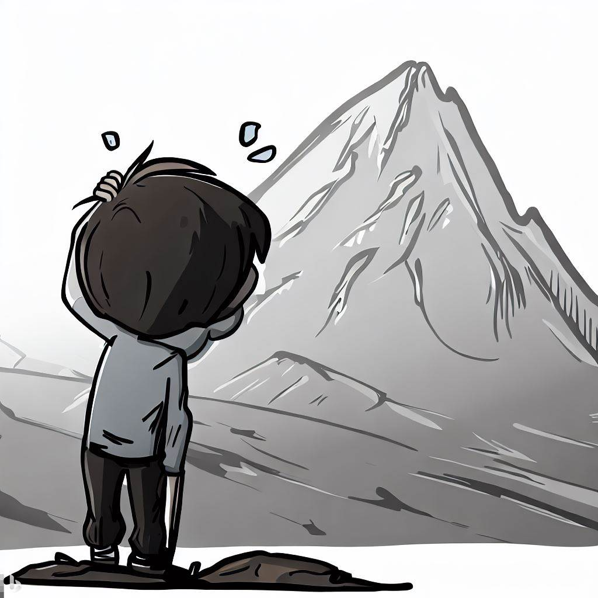{fig-align="center"}

## Thinned point process model {.smaller auto-animate="true"}

-   The true locations $\mathbf{s}=s_1,\ldots,s_m$ where a species occur are a realization of a Point Process, specifically a log-Gaussian Cox process (LGCP).

-   The true point pattern is partially observed due to **imperfect detection** and **accessibility constrains** reflected by an uneven sampling effort

::::: columns
::: {.column width="40%"}
-   The locations $\mathbf{s}=s_1,\ldots,s_n$ where opportunistic encounters have actually occurred are the result of a **thinned point process**.

$$
\begin{aligned}
\lambda^{pp}(s)&=\lambda(s)\times p(s)\\
\text{logit}(p(s)) &= \alpha^{pp}_0 + \alpha^{pp}_1\times g(s) + \ldots
\end{aligned}
$$
:::

::: {.column width="60%"}
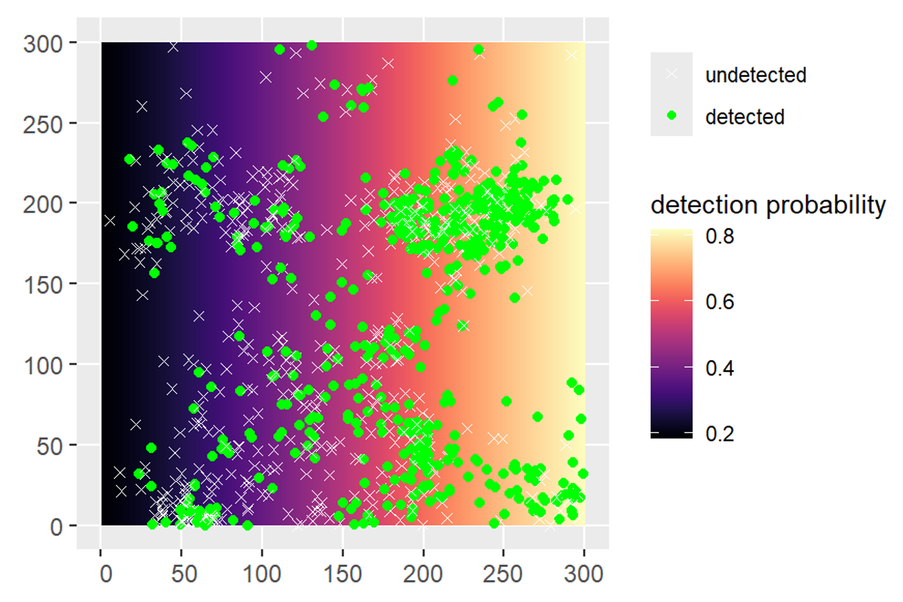{fig-align="center" width="100%" height="100%"}
:::
:::::

## Estimation of the thinned point process model {.smaller}

The likelihood function for the thinned point process is given by:

$$
L_{thinn}(\beta,\alpha) = \exp\left\{\int_B\lambda(s) p(s) ds) \right\}\prod_i^m \lambda(s_i)p(s_i)
$$

-   @simpson2016 proposed an approach to approximate both the stochastic integral and the evaluation of the field at the data points using INLA.

-   In `R-INLA` we can defined different model components as part of the additive predictor (e.g., the Stochastic Partial Differential Equation (SPDE) approach to a GRF with Matérn covariance).

-   `inlabru` allows the predictor to be a non-linear function of the parameter vector through an iterative model fitting scheme.

-   We can use `inlabru` fixed point iteration method to estimate thinning probabilities $p(s)$.

##  {background-image="Data Integration.gif" background-size="100%"}

::: {style="height: 50px;"}
:::

## Data Integration {.smaller auto-animate="true"}

Can we do better by integrating multiple data sources?

-   **Data integration**: aims to describe explicitly the differences in how datasets were assembled by using distinct observation submodels for each data source.

![Obtained from [@isaac2020]](images/data_int2.jpg){fig-align="center"}

<!-- ## Data Integration {.smaller auto-animate="true"} -->

<!-- Can we do better by integrating multiple data sources? -->

<!-- -   **Data integration**: aims to describe explicitly the differences in how datasets were assembled by using distinct observation submodels for each data source. -->

<!-- -   Combining different data sources is challenging due to differences in study design, spatial and temporal coverage, and potential **sampling biases**. -->

<!-- 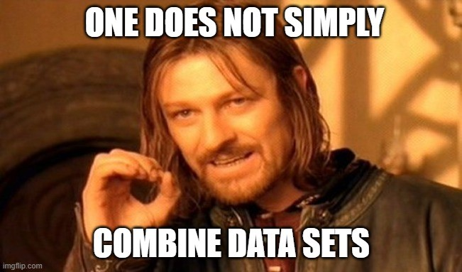{fig-align="center"} -->

## Integrated Species Distribution Model {.smaller auto-animate="true"}

-   The point process model proposed for presence-only data is defined on a continuous space, but the occupancy model for survey data is defined in a discretised space.

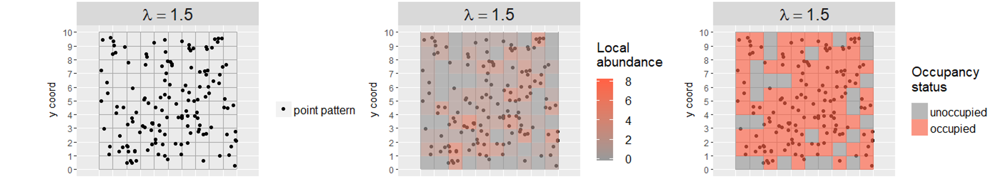{fig-align="center"}

::: fragment
-   We can use the fact that the number of individuals in a bounded region can be characterized as $N(A_i)\sim \mathrm{Poisson}(\int_{A_i}\lambda(s)~ds)$.

-   The probability that an areal unit $A_i$ is occupied by a species is given by:

$$
\psi_i = \mathrm{Pr}\left[N(A_i)>0\right] = 1 - \exp\left(-\int_{A_i}\lambda(s)~ds\right),
$$
:::

## Integrated Species Distribution Model {.smaller auto-animate="true"}

-   The point process model proposed for CS data is defined on a continuous space, but the occupancy model for survey data is defined in a discretised space.

-   We can use the fact that the number of individuals in a bounded region can be characterized as $N(A_i)\sim \mathrm{Poisson}(\int_{A_i}\lambda(s)~ds)$.

-   The probability that an areal unit $A_i$ is occupied by a species is given by:

$$
\psi_i = \mathrm{Pr}\left[N(A_i)>0\right] = 1 - \exp\left(-\int_{A_i}\lambda(s)~ds\right),
$$

Thus, the intensity-based OM likelihood becomes:

$$
L(\psi_i,p_{ij}) = \left[\prod_i^N \left(1-\exp\left\{-\int_{A_i}\lambda(s) ds\right\}\right)\prod_j^{K_i}p_{ij}^{y_{ij}}(1-p_{ij})^{1-y_{ij}} \right] \times\\ \prod_{i=N+1}^M\left[ \left(1-\exp\left\{\int_{A_i}\lambda(s) ds\right\}\right) \prod_j^{K_i}(1-p_{ij})+\exp\left\{\int_{A_i} \lambda(s)ds\right\}  \right].
$$

## Integrated Species Distribution Model {.smaller auto-animate="true"}

The marginal distribution of each site detection history is given by

$$
 L(\pmb{\psi},\textbf{p}|\mathbf{y}_1,\ldots,\mathbf{y}_M) = \prod_{i=1}^{M} \left[1-\exp\left\{-\int_{A_i}\lambda(s) ds\right\} \prod_j^{K_i} p_{ij}^{y_{ij}} (1-p_{ij})^{1-y_{ij}} + \mathbb{I}_{\sum_j y_{ij} = 0}\exp\left\{\int_{A_i} \lambda(s)ds\right\}\right]
$$

::: incremental
-   In large-scale studies, species distributions are often monitored across relatively small patches.

-   If we assume a constant intensity within each cell then $\int_{A_i}\lambda(s)ds = \lambda_i |A_i|$.
:::

## Integrated Species Distribution Model {.smaller auto-animate="true"}

The marginal distribution of each site detection history is given by

$$
 L(\pmb{\psi},\textbf{p}|\mathbf{y}_1,\ldots,\mathbf{y}_M) = \prod_{i=1}^{M} \left[1-\exp\left\{-\int_{A_i}\lambda(s) ds\right\} \prod_j^{K_i} p_{ij}^{y_{ij}} (1-p_{ij})^{1-y_{ij}} + \mathbb{I}_{\sum_j y_{ij} = 0}\exp\left\{\int_{A_i} \lambda(s)ds\right\}\right]
$$

-   In large-scale studies, species distributions are often monitored across relatively small patches.

-   If we assume a constant intensity within each cell then $\int_{A_i}\lambda(s)ds = \lambda_i |A_i|$.

-   We can link the occupancy probabilities to the intensity function ($\psi_i = 1 -\exp(|A_i|\lambda_i)$) through the cloglog link ($\mathrm{cloglog}(\psi) =\log[-\log(1-\psi_i)]$)

$$
\begin{aligned}
\mathrm{cloglog}(\psi_i) &=  \log(|A_i|) + \log(\lambda_i) \\
&= \log(|A_i|)+\beta_0 + \sum_{q=1}^P\beta_q x_{iq} + z_i\\
&= \beta_0^* + \sum_{q=1}^P\beta_q x_q(s) + z_i
\end{aligned}
$$

## Integrated Species Distribution Model {.smaller auto-animate="true"}

The marginal distribution of each site detection history is given by

$$
 L(\pmb{\psi},\textbf{p}|\mathbf{y}_1,\ldots,\mathbf{y}_M) = \prod_{i=1}^{M} \left[1-\exp\left\{-\int_{A_i}\lambda(s) ds\right\} \prod_j^{K_i} p_{ij}^{y_{ij}} (1-p_{ij})^{1-y_{ij}} + \mathbb{I}_{\sum_j y_{ij} = 0}\exp\left\{\int_{A_i} \lambda(s)ds\right\}\right]
$$

-   In large-scale studies, species distributions are often monitored across relatively small patches.

-   If we assume a constant intensity within each cell then $\int_{A_i}\lambda(s)ds = \lambda_i |A_i|$.

-   We can link the occupancy probabilities to the intensity function ($\psi_i = 1 -\exp(|A_i|\lambda_i)$) through the cloglog link ($\mathrm{cloglog}(\psi) =\log[-\log(1-\psi_i)]$)

$$
\begin{aligned}
\mathrm{cloglog}(\psi_i) &= \beta_0^* + \sum_{q=1}^P\beta_q x_q(s) + z_i
\end{aligned}
$$

-   The likelihood of the integrated model becomes $L_{\text{idm}}(\beta,\alpha,\gamma) = L_{pp}(\beta,\alpha) \times L_{occ}(\beta,\gamma)$

<!-- ## Simulation Study {auto-animate="true"} -->

<!-- 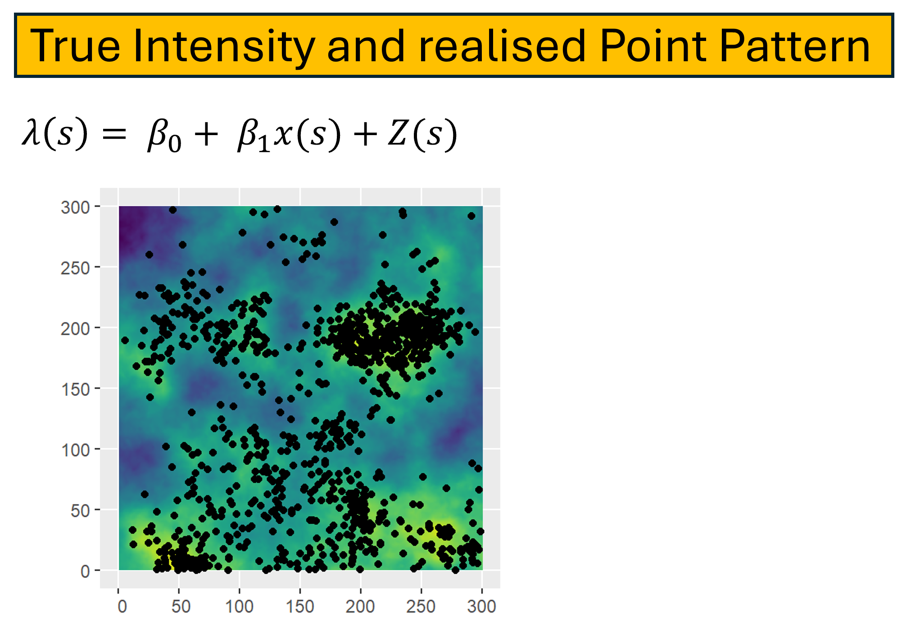{fig-align="center"} -->

<!-- ## Simulation Study {auto-animate="true"} -->

<!-- 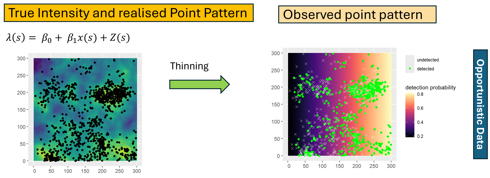{fig-align="center"} -->

<!-- ## Simulation Study {auto-animate="true"} -->

<!-- 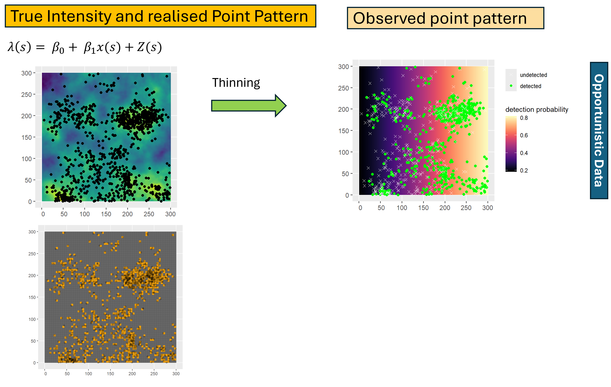{fig-align="center"} -->

<!-- ## Simulation Study {auto-animate="true"} -->

<!-- 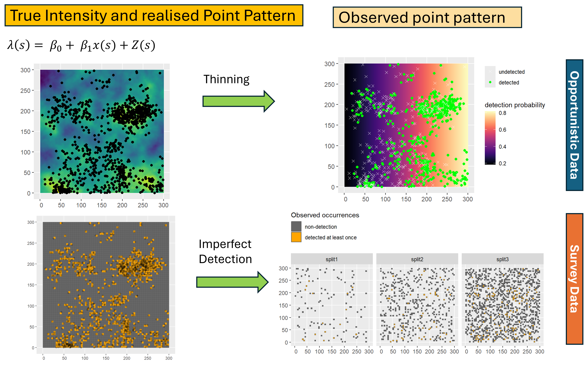{fig-align="center"} -->

<!-- ## Simulation Study -->

<!-- -   Compute MAE and correlation of $\lambda(s_{obs})$ and $\hat{\lambda(s_{obs})}$ across 100 data sets for each scenario. -->

<!-- 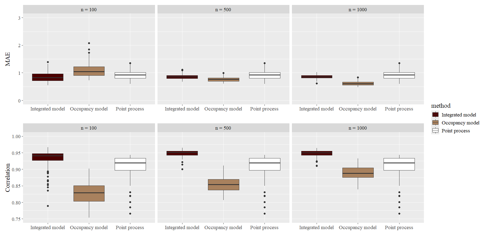{fig-align="center"} -->

## Case Study: Modelling the Distribution of the black-throated blue warbler in Pennsylvania, USA. {.smaller}

-   Occurrence data for the Black-throated blue warbler (*Setophaga caerulescens*) in Pennsylvania, USA are available from two sources:

1.  The **Pennsylvania Breeding Bird Atlas** (BBA): *Point count surveys* collected through a standardized data collection protocol from 2005 to 2008 .

2.  The second data set does not follow a standard data collection protocol, but instead are observations reported by citizen scientists to the **eBird** platform in 2008.

{fig-align="center"}

## Modelling Black-throated blue warbler {.smaller auto-animate="true"}

-   Detection/non-detection BBA survey data are available in a subregion of the Pennsylvania State.

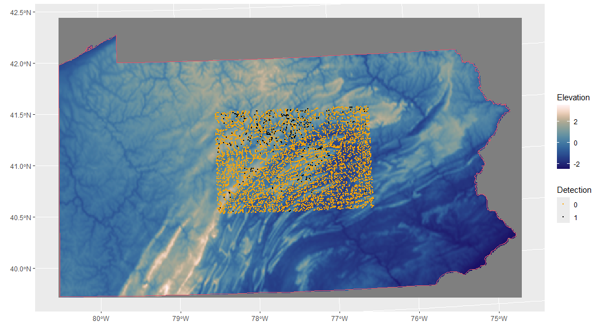{fig-align="center"}

## Modelling Black-throated blue warbler {.smaller auto-animate="true"}

-   `eBird` citizen science data are usually biased due to **uneven sampling effort**.
-   Use the locations where other species have been observed as a proxy of sampling intensity

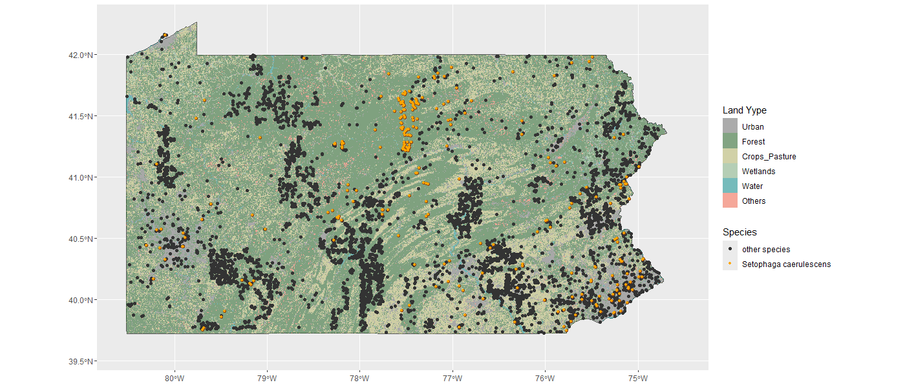{fig-align="center"}


## Modelling Black-throated blue warbler {.smaller auto-animate="true"}

-   `eBird` citizen science data are usually biased due to **uneven sampling effort**.
-   Use the locations where other species have been observed as a proxy of sampling intensity

$$
\log\lambda^E(s) = \gamma_0 + \xi(s) \rightarrow \widehat{\text{effort}}
$$

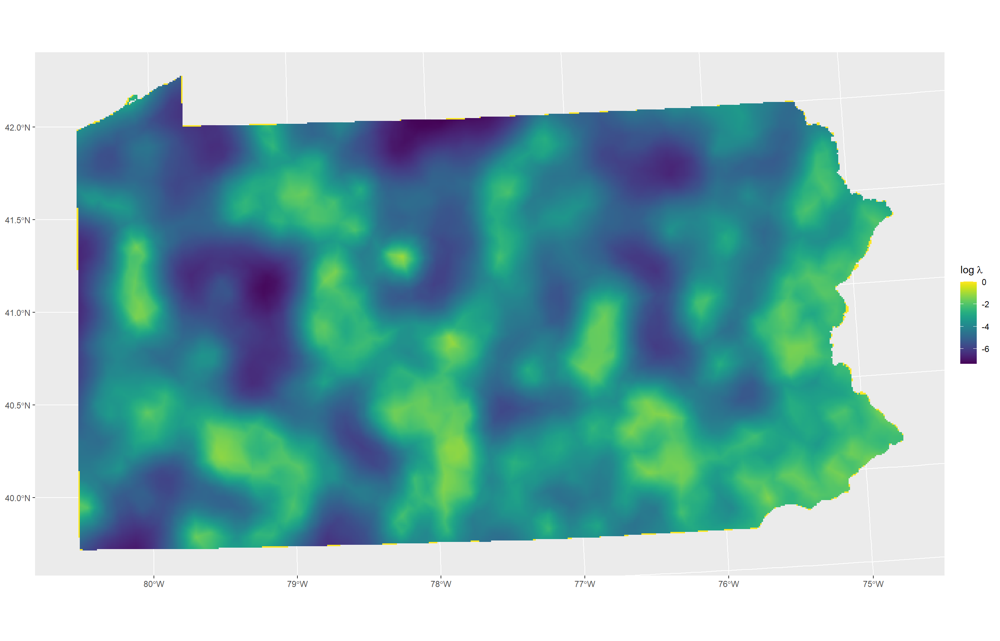{fig-align="center"}


## Modelling Black-throated blue warbler {.smaller auto-animate="true"}

-   `inlabru` facilitates fitting multi-likelihood models that share a common state-space process parameters but have different observational processes.

$$
\begin{aligned}
\log(\lambda(s)^{(\text{eBird})}) &= \beta^*_0 + \color{black}{\beta'X(s)} + \color{black}{Z(s)} + \log(p(s)) \\
\mathrm{logit}(p(s)^{(\text{eBird})}) &= \alpha_0 + \alpha_1 \times \hat{\text{effort}}(s)\\
\mathrm{cloglog}(\psi(s)^{(\text{BBA})}) &=  |C_i| + \color{black}{\beta_0} + \color{black}{\beta'X(s)} + \color{black}{Z(s)} \\
\mathrm{logit}(p_{ij}^{(\text{BBA})}) &= \gamma_0 + \gamma_1 \times \text{Canopy} + \gamma_2 \times \text{LDI}
\end{aligned}
$$

-   LDI is the *land development index* proposed by @brown2005. The smaller the index values is, the less the urban development is.

## Modelling Black-throated blue warbler {.smaller auto-animate="true"}

-   `inlabru` facilitates fitting multi-likelihood models that share a common state-space process parameters but have different observational processes.

$$
\begin{aligned}
\log(\lambda(s)^{(\text{eBird})}) &= \beta^*_0 + \color{red}{\beta'X(s)} + \color{red}{Z(s)} + \log(p(s)) \\
\mathrm{logit}(p(s)^{(\text{eBird})}) &= \alpha_0 + \alpha_1 \times \hat{\text{effort}}(s)\\
\mathrm{cloglog}(\psi(s)^{(\text{BBA})}) &=  |C_i| + \color{red}{\beta_0} + \color{red}{\beta'X(s)} + \color{red}{Z(s)} \\
\mathrm{logit}(p_{ij}^{(\text{BBA})}) &= \gamma_0 + \gamma_1 \times \text{Canopy} + \gamma_2 \times \text{LDI}
\end{aligned}
$$

-   LDI is the *land development index* proposed by @brown2005. The smaller the index values is, the less the urban development is.

## Modelling Black-throated blue warbler {.smaller auto-animate="true"}

-   `inlabru` facilitates fitting multi-likelihood models that share a common state-space process parameters but have different observational processes.

```{r}
#| echo: true
#| eval: false
#| code-line-numbers: "1-3"

components_idm =  ~ Intercept(1) +
  elevation(elevation_raster, model = "linear") +...+ spatial_field(geometry, model=matern) +
  alpha_0(1,mean.linear= 3, prec.linear= 1/2.72) + alpha_1(1,mean.linear =1, prec.linear= 1/2.72)

formula_occ = inla.mdata(Y, X) ~  log(.data.$radius) + Intercept  + elevation  + ... + spatial_field

formula_thinn = geometry ~ Intercept   + elevation + ...+ spatial_field +
                           log_detect(xy = geometry,p1 =  alpha_0, p2 = alpha_1)

lik_occ =  bru_obs(formula = formula_occ,
               family = "occupancy",
               data = bba_sf,
               response_data = list(X = X_mat,Y = Y_mat),
               control.family = list(control.link = list(model = "cloglog"),
                                     link.simple = "logit"))

lik_thinn =  bru_obs("cp",
                  formula = formula_thinn ,
                  data =  ebird_sf ,
                  samplers = penn_state,
                  domain = list(geometry = mesh))

fit_IDM  = bru(components_idm , lik_occ , lik_thinn)
```

## Modelling Black-throated blue warbler {.smaller auto-animate="true"}

-   `inlabru` facilitates fitting multi-likelihood models that share a common state-space process parameters but have different observational processes.

```{r}
#| echo: true
#| eval: false
#| code-line-numbers: "5-8"

components_idm =  ~ Intercept(1) +
  elevation(elevation_raster, model = "linear") +...+ spatial_field(geometry, model=matern) +
  alpha_0(1,mean.linear= 3, prec.linear= 1/2.72) + alpha_1(1,mean.linear =1, prec.linear= 1/2.72)

formula_occ = inla.mdata(Y, X) ~  log(.data.$radius) + Intercept  + elevation  + ... + spatial_field

formula_thinn = geometry ~ Intercept   + elevation + ...+ spatial_field +
                           log_detect(xy = geometry,p1 =  alpha_0, p2 = alpha_1)

lik_occ =  bru_obs(formula = formula_occ,
               family = "occupancy",
               data = bba_sf,
               response_data = list(X = X_mat,Y = Y_mat),
               control.family = list(control.link = list(model = "cloglog"),
                                     link.simple = "logit"))

lik_thinn =  bru_obs("cp",
                  formula = formula_thinn ,
                  data =  ebird_sf ,
                  samplers = penn_state,
                  domain = list(geometry = mesh))

fit_IDM  = bru(components_idm , lik_occ , lik_thinn)

```

## Modelling Black-throated blue warbler {.smaller auto-animate="true"}

-   `inlabru` facilitates fitting multi-likelihood models that share a common state-space process parameters but have different observational processes.

```{r}
#| echo: true
#| eval: false
#| code-line-numbers: "9-21"

components_idm =  ~ Intercept(1) +
  elevation(elevation_raster, model = "linear") +...+ spatial_field(geometry, model=matern) +
  alpha_0(1,mean.linear= 3, prec.linear= 1/2.72) + alpha_1(1,mean.linear =1, prec.linear= 1/2.72)

formula_occ = inla.mdata(Y, X) ~  log(.data.$radius) + Intercept  + elevation  + ... + spatial_field

formula_thinn = geometry ~ Intercept   + elevation + ...+ spatial_field +
                           log_detect(xy = geometry,p1 =  alpha_0, p2 = alpha_1)

lik_occ =  bru_obs(formula = formula_occ,
               family = "occupancy",
               data = bba_sf,
               response_data = list(X = X_mat,Y = Y_mat),
               control.family = list(control.link = list(model = "cloglog"),
                                     link.simple = "logit"))

lik_thinn =  bru_obs("cp",
                  formula = formula_thinn ,
                  data =  ebird_sf ,
                  samplers = penn_state,
                  domain = list(geometry = mesh))

fit_IDM  = bru(components_idm , lik_occ , lik_thinn)

```

## Modelling Black-throated blue warbler {.smaller auto-animate="true"}

-   `inlabru` facilitates fitting multi-likelihood models that share a common state-space process parameters but have different observational processes.

```{r}
#| echo: true
#| eval: false
#| code-line-numbers: "23"

components_idm =  ~ Intercept(1) +
  elevation(elevation_raster, model = "linear") +...+ spatial_field(geometry, model=matern) +
  alpha_0(1,mean.linear= 3, prec.linear= 1/2.72) + alpha_1(1,mean.linear =1, prec.linear= 1/2.72)

formula_occ = inla.mdata(Y, X) ~  log(.data.$radius) + Intercept  + elevation  + ... + spatial_field

formula_thinn = geometry ~ Intercept   + elevation + ...+ spatial_field +
                           log_detect(xy = geometry,p1 =  alpha_0, p2 = alpha_1)

lik_occ =  bru_obs(formula = formula_occ,
               family = "occupancy",
               data = bba_sf,
               response_data = list(X = X_mat,Y = Y_mat),
               control.family = list(control.link = list(model = "cloglog"),
                                     link.simple = "logit"))

lik_thinn =  bru_obs("cp",
                  formula = formula_thinn ,
                  data =  ebird_sf ,
                  samplers = penn_state,
                  domain = list(geometry = mesh))

fit_IDM  = bru(components_idm , lik_occ , lik_thinn)

```

## Results Integrated Model: posterior summaries {.smaller .striped .hover}

| Parameter                                | Posterior mean and 95% CrIs |
|:-----------------------------------------|:----------------------------|
| Intercept ($\beta_0$)                    | -3.97 (-5.37,-1.61)         |
| Canopy ($\beta_1$)                       | **0.87** (0.65,1.08)        |
| Elevation ($\beta_3$)                    | **1.12** (0.93,1.3)         |
| Slope ($\beta_4$)                        | 0.07 (-0.03,0.17)           |
| Aspect ($\beta_5$)                       | -0.13 (-0.24,-0.03)         |
| Intercept - detection eBird ($\alpha_0$) | 2.55 (1.67,3.44)            |
| Effort ($\alpha_1$)                      | **1.46** (1.22,1.7)         |
| Intercept - detection BBA ($\gamma_0$)s  | 0.93 (0.37,1.5)             |
| Canopy ($\gamma_1$)                      | 0.31 (-0.14,0.76)           |
| LDI ($\gamma_1$)                         | **0.68** (0.13,1.23)        |
| $\rho_z$                                 | 129.82 (79.92,211.03)       |
| $\sigma_z$                               | 2.04 (1.47,2.82)            |

## Results Integrated Model: Predictions {.smaller}

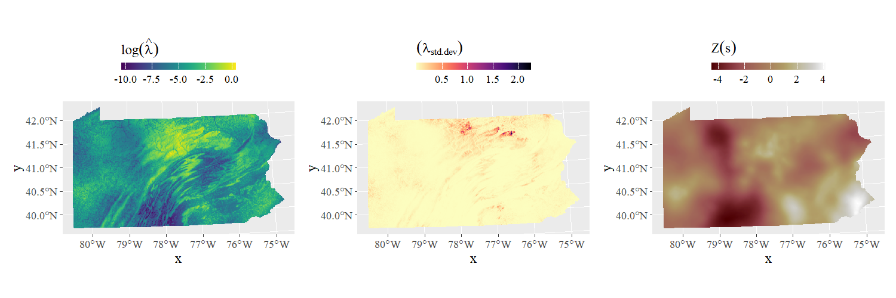{fig-align="center" width="777"}

## Discussion {.smaller auto-animate="true"}

-   Over the last decade there has been bloom in the development of tools for fitting ISDMs (*with quite a few wrappers around INLA*).

{fig-align="center"}

## Discussion {.smaller auto-animate="true"}

-   Over the last decade there has been bloom in the development of tools for fitting ISDMs (*with quite a few wrappers around INLA*).

-   Despite their popular use, the increasing adoption of ISDMs calls for careful scrutiny, as these models should not be adopted uncritically.

## Discussion {.smaller auto-animate="true"}

-   Over the last decade there has been bloom in the development of tools for fitting ISDMs (*with quite a few wrappers around INLA*).

-   Despite their popular use, the increasing adoption of ISDMs calls for careful scrutiny, as these models should not be adopted uncritically.

-   It is unclear whether an ISDM for the Black-throated Blue Warbler provides any more meaningful information than a point process model.

$$
I_\theta(W)=n(\mathbf{s} \cap W) - \int_W\widehat{\lambda}_\theta(u) du
$$

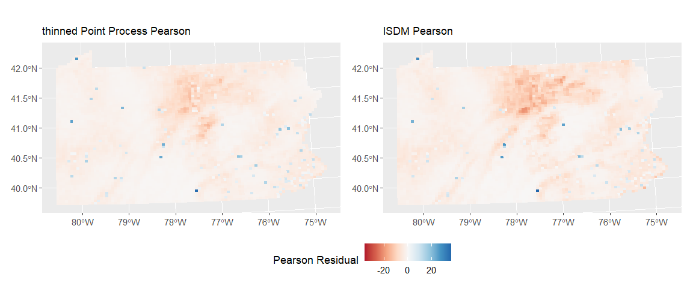{fig-align="center"}

## Discussion {.smaller auto-animate="true"}

-   Over the last decade there has been bloom in the development of tools for fitting ISDMs (*with quite a few wrappers around INLA*).

-   Despite their popular use, the increasing adoption of ISDMs calls for careful scrutiny, as these models should not be adopted uncritically.

-   It is unclear whether an ISDM for the Black-throated Blue Warbler provides any more meaningful information than a point process model.

-   This example has been presented as a case study for several works.

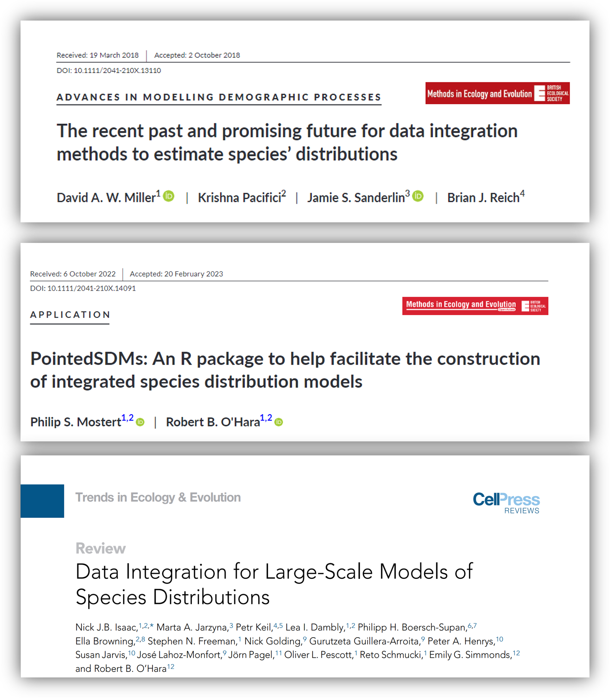{fig-align="center" width="540"}

## Discussion - further insights {.smaller auto-animate="true"}

-   Do parameter-rich integrated models improve our ecological understanding?

-   In many situations, the vast amount of unstructured data far exceeds the amount of survey data.

-   Are integrated models even necessary when unstructured data has been adequately modeled?

## Discussion - further insights {.smaller auto-animate="true"}

-   Do parameter-rich integrated models improve our ecological understanding?

    -   How do we quantify the information gained by data integration?

-   In many situations, the vast amount of unstructured data far exceeds the amount of survey data.

-   Are integrated models even necessary when unstructured data has been adequately modeled?

## Discussion - further insights {.smaller auto-animate="true"}

-   Do parameter-rich integrated models improve our ecological understanding?

-   In many situations, the vast amount of unstructured data far exceeds the amount of survey data.

    -   How can we weight high-quality survey data so that it isn't overwhelmed by unstructured data?

-   Are integrated models even necessary when unstructured data has been adequately modeled?

## Discussion - further insights {.smaller auto-animate="true"}

-   Do parameter-rich integrated models improve our ecological understanding?

-   In many situations, the vast amount of unstructured data far exceeds the amount of survey data.

-   Are integrated models even necessary when unstructured data has been adequately modeled?

    -   How should we evaluate whether biases have been adequately modeled?

## Discussion - further insights {.smaller auto-animate="true"}

-   Do parameter-rich integrated models improve our ecological understanding?

-   In many situations, the vast amount of unstructured data far exceeds the amount of survey data.

-   Are integrated models even necessary when unstructured data has been adequately modeled?

{fig-align="center"}

## Where do I learn more about INLA and `inlabru` {.smaller}

::: {.callout-warning icon="false"}
## Website-tutorials

`inlabru` <https://inlabru-org.github.io/inlabru/>

`R-INLA` <https://www.r-inla.org/home>
:::

::: {.callout-tip icon="false"}
## Discussion forums

`inlabru` <https://github.com/inlabru-org/inlabru/discussions>

`R-INLA` <https://groups.google.com/g/r-inla-discussion-group>
:::

::: {.callout-note icon="false"}
## Books

-   Blangiardo, M., & Cameletti, M. (2015). Spatial and spatio-temporal Bayesian models with R-INLA. John Wiley & Sons.

-   Gómez-Rubio, V. (2020). Bayesian inference with INLA. Chapman and Hall/CRC.

-   Krainski, E., Gómez-Rubio, V., Bakka, H., Lenzi, A., Castro-Camilo, D., Simpson, D., ... & Rue, H. (2018). Advanced spatial modeling with stochastic partial differential equations using R and INLA. Chapman and Hall/CRC.

-   Wang, X., Yue, Y. R., & Faraway, J. J. (2018). Bayesian regression modeling with INLA. Chapman and Hall/CRC.
:::

##  {background-image="river.png" background-size="100%"}

::: {style="height: 50px;"}
:::

::: quote-gold
> "*An understanding of the natural world, and what's in it as a source of not only great curiosity but great fulfillment.*"
>
> Sir. David Attenborough
:::

`Thanks for your attention`

## Acknowledgments

{fig-align="center"}

## References {.smaller .scrollable style="margin-top: 0;"}

::: {#refs}
:::
